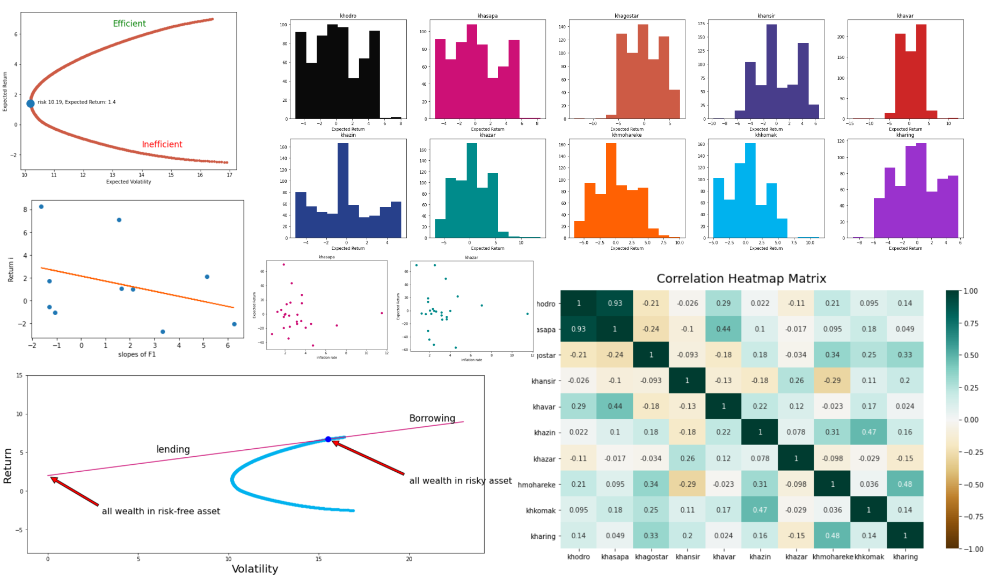

# Portfolio-Analysis-and-Risk-Management

## Table of Contents
1. [Overview](#overview)
2. [Project Structure](#project-structure)
   - [1. Data Import and Preprocessing](#1-data-import-and-preprocessing)
   - [2. Question 1: Stock Data Analysis](#2-question-1-stock-data-analysis)
   - [3. Question 2: Portfolio Optimization](#3-question-2-portfolio-optimization)
   - [4. Question 3: Efficient Frontier](#4-question-3-efficient-frontier)
   - [5. Question 4: Capital Market Line (CML)](#5-question-4-capital-market-line-cml)
   - [6. Question 5: Beta Calculation](#6-question-5-beta-calculation)
   - [7. Question 7: Risk-Return Ratios](#7-question-7-risk-return-ratios)
   - [8. Question 8: Inflation and Stock Returns](#8-question-8-inflation-and-stock-returns)
   - [9. Question 9: Arbitrage Pricing Theory (APT)](#9-question-9-arbitrage-pricing-theory-apt)
   - [10. Question 10: Value at Risk (VaR) Calculation](#10-question-10-value-at-risk-var-calculation)

## Overview

This project is a financial analysis project that explores various aspects of the stock market, including data analysis, risk assessment, portfolio optimization, and Value at Risk (VaR) calculation. The project is implemented in Python and uses popular libraries such as pandas, matplotlib, seaborn, and scikit-learn for data analysis and visualization.

## Project Structure

The project is organized into several sections, each addressing specific questions or tasks related to financial analysis. Here's an overview of the project structure and key sections:

### 1. Data Import and Preprocessing

- Import important libraries for data analysis.
- Read stock market data from CSV files for multiple companies and the market index.
- Calculate the daily return of the market index.

### 2. Question 1: Stock Data Analysis

- Analyze the stock data for various companies, including calculating daily returns.
- Compute and display the mean and standard deviation of daily returns for each company.
- Create a scatter plot to visualize the relationship between risk (standard deviation) and expected return (mean).

### 3. Question 2: Portfolio Optimization

- Optimize portfolio weights to maximize return or minimize risk using the mean-variance optimization approach.
- Calculate and display the optimal portfolio weights, risk, and expected return with and without short selling.

### 4. Question 3: Efficient Frontier

- Plot the efficient frontier by varying the target return and finding the corresponding minimum risk for each point.

### 5. Question 4: Capital Market Line (CML)

- Plot the Capital Market Line, including the tangent point where an investor can choose a combination of the risk-free asset and the risky portfolio.

### 6. Question 5: Beta Calculation

- Calculate the beta (systematic risk) for each stock to determine its relationship with the market.
- Categorize stocks as aggressive, defensive, or neutral based on their beta values.

### 7. Question 7: Risk-Return Ratios

- Calculate the Sharpe ratio, Treynor ratio, and Alpha Jensen ratio for each stock.
- Analyze and categorize stocks based on these ratios.

### 8. Question 8: Inflation and Stock Returns

- Analyze the relationship between inflation rates and stock returns.
- Fit regression models to quantify the relationship between inflation and returns.
- Calculate systematic and non-systematic risk for each stock.

### 9. Question 9: Arbitrage Pricing Theory (APT)

- Implement the Arbitrage Pricing Theory by fitting a regression model between stock returns and factor slopes.

### 10. Question 10: Value at Risk (VaR) Calculation

- Calculate VaR using different methods: Historical, Parametric, and Monte Carlo simulation.
- Compare the VaR results across different methods.
- Calculate the monthly VaR for each stock.
- Calculate the VaR of an optimal portfolio and perform backtesting using binomial tests.
